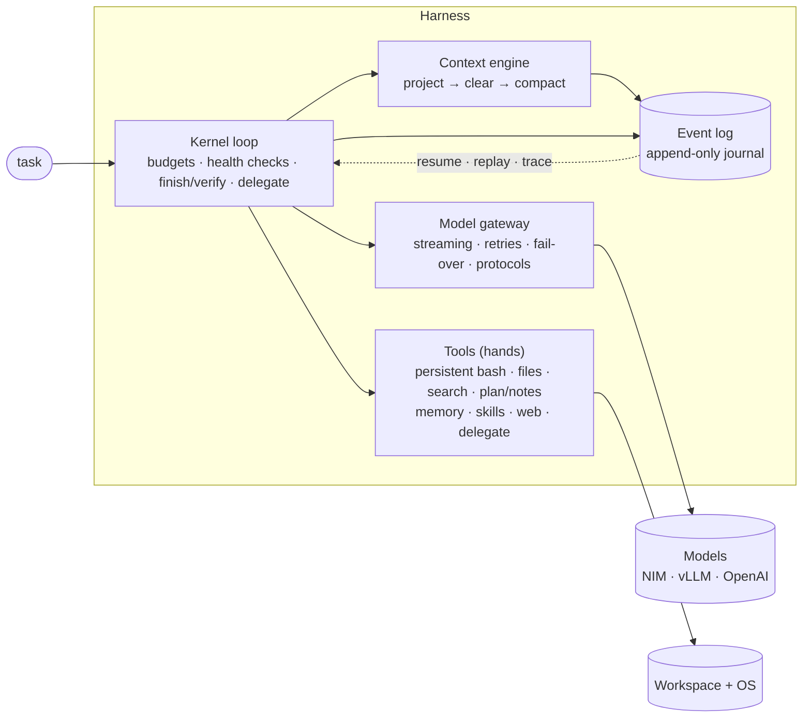

# Polymath — a generalist agent, engineered end to end

Polymath is a working **all-round autonomous agent** and the **harness** that makes it reliable: give it a task in plain language and a workspace, and it writes and tests code, debugs, operates the terminal, analyses data, researches documents and the web, and produces written deliverables — then reports what it did and how it verified it.

Everything here is implemented, tested offline, and **evaluated live on NVIDIA NIM models with hidden verifiers**, including ablations that measure what each part of the harness is worth. Results — including the unflattering ones — are in [`docs/evaluation/RESULTS.md`](docs/evaluation/RESULTS.md).

```text
$ polymath run "Write primes.py that prints how many primes are below 1,000,000 and their sum; run it" -w ./work
━━ task Write primes.py that prints how many primes are below 1,000,000 and their sum; run it
  ▶ write_file primes.py (787 chars)
  ▶ bash python3 primes.py
    ✓ Traceback … ModuleNotFoundError: No module named 'numpy'
  numpy isn't installed — I'll switch to a pure standard-library sieve.
  ▶ write_file primes.py (860 chars)
  ▶ bash python3 primes.py
    ✓ Number of primes below 1000000: 78498
  ▶ bash python3 - <<'EOF'   (independent cross-check)
━━ completed (finished) · 7 turns · 7 tool calls · 33,028 tokens · 25.6s
78,498 primes; sum 37,550,402,023 — verified with an independent second sieve.
```

---

## Architecture at a glance



Five decisions define it ([02 — System architecture](docs/02-system-architecture.md)):

1. **Brain and hands are decoupled** — the loop only ever calls `execute(call) → result`.
2. **The session is an append-only event log**; the model's context is a pure projection of it → crash-resume, deterministic replay, audit and tracing from one mechanism.
3. **The terminal is the primary actuator** — a persistent, hardened bash session ([07](docs/07-terminal-subsystem.md), [ADR-001](docs/adr/ADR-001-terminal-as-primary-actuator.md)).
4. **Deterministic harness, stochastic leaves** — plus deterministic, journaled workflows for fixed procedures ([08](docs/08-determinism.md)).
5. **Context is a budget, engineered every turn**, with a cache-stable prefix ([05](docs/05-context-engineering.md)).

## Quickstart

```bash
python3 --version                       # 3.11+; no dependencies (standard library only)
export NVIDIA_NIM_API_KEY=nvapi-…        # or any OpenAI-compatible endpoint via POLYMATH_BASE_URL
python3 -m polymath run "Summarise report.txt into summary.md in under 150 words" -w ./work
python3 -m polymath chat -w ./work       # interactive
python3 -m polymath trace <session>      # span tree; --events for the raw journal
python3 -m polymath resume <session>     # continue after a crash or provider outage
python3 -m polymath workflow fix-until-green -w ./repo --input cmd="python3 -m unittest"
```

Python API:
```python
from polymath import Runtime, load_config
res = Runtime(load_config()).run("Fix the failing tests", "./repo", verify_command="python3 -m unittest")
print(res.state, res.stop_reason, res.answer)
```

## Verify it yourself

```bash
python3 -m unittest discover -s tests -t .    # 122 offline tests (~12 s): chaos, kill -9, spec conformance
python3 -m evals.reference                     # proves all 34 eval verifiers: reject empty, accept reference
python3 -m evals.runner --tasks core --out /tmp/run   # live evaluation (needs an API key)
```

## Documentation

| # | Document | What it answers |
|---|---|---|
| 00 | [Vision & principles](docs/00-vision-and-principles.md) | What we're building and the rules for every trade-off |
| 01 | [Requirements](docs/01-requirements.md) | Capabilities, FR/NFR with traceability to code and tests |
| 02 | [System architecture](docs/02-system-architecture.md) | C4 views, components, runtime flows, deployment |
| 03 | [Execution model](docs/03-execution-model.md) | **How it executes any task**: the universal algorithm, stop conditions, error matrix |
| 04 | [Harness specification](docs/04-harness-specification.md) | Invariants, event catalogue, storage, resume/replay semantics, concurrency |
| 05 | [Context engineering](docs/05-context-engineering.md) | Clearing, compaction, cache-shape discipline, calibration |
| 06 | [Tool system](docs/06-tool-system.md) | Tool contract, registry, catalogue, code mode, MCP mapping |
| 07 | [Terminal subsystem](docs/07-terminal-subsystem.md) | **Should agents have terminals?** Yes — and how to make one robust |
| 08 | [Determinism](docs/08-determinism.md) | Where determinism lives; workflows vs agents; replay |
| 09 | [Memory architecture](docs/09-memory-architecture.md) | Working, episodic, semantic, procedural memory |
| 10 | [Multi-agent orchestration](docs/10-multi-agent-orchestration.md) | Delegation contract; A2A mapping |
| 11 | [Model gateway](docs/11-model-gateway.md) | Streaming, retries, fail-over, protocols, NIM model matrix |
| 12 | [Observability](docs/12-observability.md) | Events, OTel GenAI spans, console, debugging playbook |
| 13 | [Evaluation & testing](docs/13-evaluation-and-testing.md) | Test pyramid, eval design, verifier validation |
| 14 | [Configuration & operations](docs/14-configuration-and-operations.md) | Config reference, CLI, runbook |
| 15 | [Performance & cost](docs/15-performance-and-cost.md) | Where time and tokens go, measured |
| 16 | [Roadmap](docs/16-roadmap.md) | What's next (and what isn't done) |
| 17 | [Prompt specification](docs/17-prompt-specification.md) | Every prompt the models see, verbatim (generated from code) |
| — | [ADRs](docs/adr/README.md) · [Glossary](docs/glossary.md) · [Schemas](spec/schemas) · [**Results**](docs/evaluation/RESULTS.md) | |

## Repository layout

```text
polymath/            the agent & harness (stdlib only)
  kernel/            agent loop, runtime, router, verifier, prompts, workflows
  context/           projection, clearing/compaction engine, token calibration
  gateway/           OpenAI-compatible streaming client, fail-over, protocols, record/replay
  tools/             terminal, files, search, planning, memory, skills, web, delegate
  memory/ observability/ skills/   BM25 store · tracer & console · 7 built-in playbooks
tests/               121 deterministic tests (no network)
evals/               34 live tasks with hidden verifiers, reference solutions, runner
spec/schemas/        JSON Schemas for every contract (validated against real runs)
docs/                architecture, specifications, ADRs, results
```
