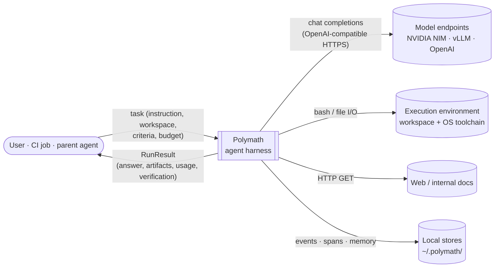
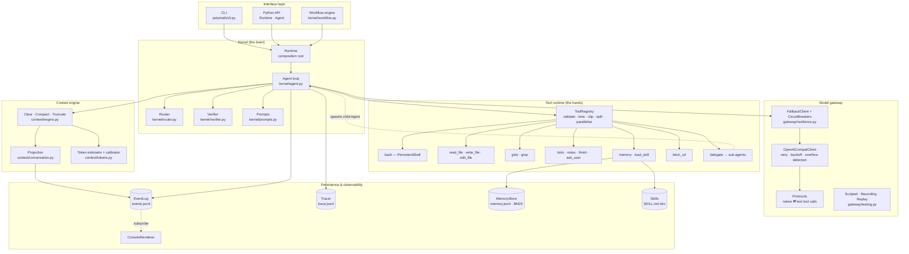
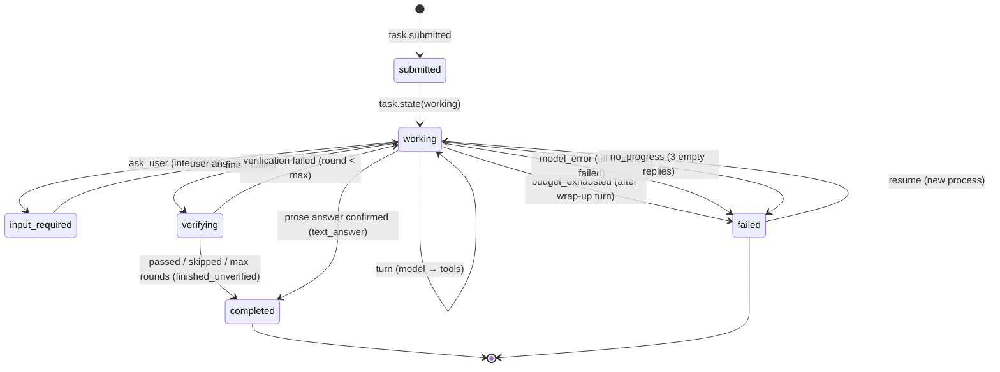
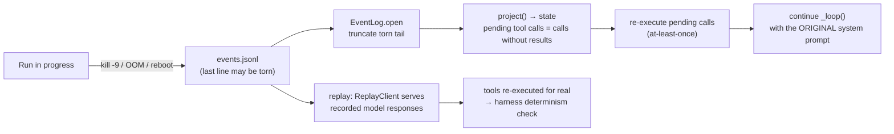

# 02 — System Architecture

> Status: **Implemented** (v1.0.0) · Code: `polymath/` · Related: [03 Execution model](03-execution-model.md), [04 Harness spec](04-harness-specification.md)

This document describes Polymath's structure top-down, C4 style: system context → containers → components → the key runtime flows. Every box in these diagrams maps to a module you can open.

---

## 1. Architectural thesis

Polymath is built on five decisions. Everything else follows from them.

| # | Decision | Consequence |
|---|---|---|
| 1 | **Brain and hands are decoupled.** The model loop (brain) never touches the OS directly; everything goes through a uniform tool interface `execute(call) → ToolResult` (hands). | Tools, sandboxes and sub-agents are interchangeable; a crashed tool is just an error result; the loop is small and testable. |
| 2 | **The session is an append-only event log, and the model's context is a pure projection of it.** | Crash-resume, deterministic replay, auditability and tracing come from one mechanism instead of four. |
| 3 | **The terminal is the primary actuator.** A persistent bash session subsumes hundreds of special-purpose tools. | A generalist agent with a small toolset (14 tools) that can still do "anything a developer can do in a shell". |
| 4 | **Determinism lives in the harness, non-determinism in the model.** Control flow, budgets, termination, context rewrites and verification are deterministic code; only the model's next action is sampled. | Runs are bounded, reproducible (via replay) and debuggable; workflows can pin control flow entirely. |
| 5 | **Context is a budgeted resource, engineered every turn.** Clearing → compaction → emergency truncation, with a cache-stable prefix. | Long-horizon tasks fit any window; token cost stays proportional to the work in progress, not its history. |

---

## 2. System context (C4 level 1)



| Actor / system | Interface | Notes |
|---|---|---|
| Requester | CLI (`polymath run`), Python API (`Runtime.run`), workflows | Humans, CI pipelines, or another agent (delegation). |
| Model endpoints | `POST /v1/chat/completions` | Primary + fallback chain + a cheaper utility model. |
| Execution environment | Persistent bash, direct file I/O | Workspace is the unit of isolation between tasks. |
| Local stores | JSONL files | Sessions (`events.jsonl`, `trace.jsonl`, spill files), long-term memory, skills. |

---

## 3. Containers & layers (C4 level 2)



### Layer responsibilities and rules

| Layer | Owns | Must not |
|---|---|---|
| Interface | Parsing user intent into a `TaskSpec`; presenting `RunResult`. | Contain agent logic. |
| Kernel | The loop, budgets, termination, health checks, verification, delegation. | Talk HTTP or touch files directly. |
| Context engine | What the model sees each turn. | Mutate history — it only *appends* clear/compact events. |
| Gateway | Wire formats, transport resilience, fail-over. | Know about tools' semantics or the task. |
| Tool runtime | Side effects on the environment; argument validation; output budgeting. | Call models (except `delegate`, via the kernel callback). |
| Persistence | Durable facts. | Interpret them — projections live in the context engine. |

Dependency direction is strictly downward; `delegate` is the only upward edge and it goes through an injected callback (`ToolContext.spawn_subagents`), so the tool layer never imports the kernel.

---

## 4. Component catalogue (C4 level 3)

| Component | Module | Key types / functions | Contract |
|---|---|---|---|
| Runtime | `kernel/runtime.py` | `Runtime.run / resume / replay / new_session` | Composition root; one per process; thread-safe for concurrent sessions. |
| Agent | `kernel/agent.py` | `Agent.run`, `Agent.resume`, `_loop`, `_on_finish`, `_spawn_subagents` | Invariants I1–I4 ([04](04-harness-specification.md#2-kernel-invariants)). |
| Router | `kernel/router.py` | `heuristic_profile`, `llm_profile`, `TaskProfile` | Adds hints only; never changes semantics. |
| Verifier | `kernel/verifier.py` | `Verifier.verify` | Command check (deterministic) or criteria judge (model). |
| Workflow engine | `kernel/workflow.py` | `Workflow`, `Step`, `Loop`, `WorkflowContext` | Journaled steps; resume skips completed steps. |
| Context engine | `context/engine.py` | `ContextEngine.prepare` | Output fits `window − max_output`; tool pairs always valid. |
| Projection | `context/conversation.py` | `project`, `materialize` | Pure functions of the event log. |
| Gateway client | `gateway/openai_compat.py` | `OpenAICompatClient.complete` | Retries transient faults; typed `ModelError` otherwise. |
| Fail-over | `gateway/resilience.py` | `FallbackClient`, `CircuitBreaker` | Fails over only on model-health errors. |
| Protocols | `gateway/protocols.py` | `NativeProtocol`, `TextProtocol` | Canonical `Message` ⇄ wire; forgiving decode. |
| Registry | `tools/base.py` | `ToolRegistry.execute / execute_batch` | A tool can never crash the kernel. |
| Terminal | `tools/terminal.py` | `PersistentShell.run`, `BashTool` | See [07](07-terminal-subsystem.md). |
| Event log | `events.py` | `EventLog.append / events / load` | Append-only, dense `seq`, torn-tail repair. |
| Tracer | `observability/tracer.py` | `Tracer.span / record` | OTel GenAI span names and attributes. |
| Memory | `memory/store.py` | `MemoryStore.save / search` | BM25; tombstone deletes. |

---

## 5. Runtime flows

### 5.1 One turn of the agent loop

```mermaid
sequenceDiagram
    autonumber
    participant K as Kernel (Agent._loop)
    participant L as EventLog
    participant C as ContextEngine
    participant G as Gateway
    participant M as Model
    participant R as ToolRegistry
    participant X as Tools / OS

    K->>L: project(events) → state (turns, usage, plan…)
    K->>K: budget check (turns · tokens · time · tool calls)
    K->>C: prepare(system, tools)
    C->>L: materialize view; maybe append context.cleared / context.compacted
    C-->>K: messages (≤ window − max_output)
    K->>G: complete(ChatRequest)
    G->>M: POST /chat/completions (retries, fail-over)
    M-->>G: assistant message (+ tool_calls)
    G-->>K: ModelResponse (normalised)
    Note over K,L: journal BEFORE acting (invariant I1)
    K->>L: append model.response
    K->>R: execute_batch(tool_calls)
    R->>X: run (parallel-safe groups concurrently)
    X-->>R: outputs
    R-->>K: ToolResults (validated, clipped, spilled)
    K->>L: append tool.result × n
    K->>K: health checks (loop detection, error streak)
    alt finish was called
        K->>K: verify (command / judge)
        K->>L: append verification.result, task.completed
    end
```

### 5.2 Task lifecycle



`verifying` is a kernel phase inside `working` (it is recorded as `verification.result` events, not as a `task.state`). States follow the A2A v1.0 task state vocabulary (`submitted`, `working`, `input_required`, `completed`, `failed`, `canceled`), so a Polymath agent maps 1:1 onto an A2A server if exposed over that protocol ([10](10-multi-agent-orchestration.md#7-a2a-mapping)).

### 5.3 Crash, resume, replay



---

## 6. Deployment view

| Topology | How | When |
|---|---|---|
| Single process (default) | `polymath run …` on a workstation/VM/container | Interactive use, CI jobs. |
| Worker pool | N processes sharing a sessions directory; one session per process | Batch evaluation (`evals/runner.py` uses threads). |
| Sandboxed hands | Run the whole harness inside a container/microVM (Firecracker, gVisor, Kata); workspace = mounted volume | Multi-tenant or untrusted workloads. The brain/hands split means the sandbox only needs `bash` + the workspace. |
| Remote brain, local hands | Future: tool calls over RPC to a hands service | See [16 Roadmap](16-roadmap.md). |

Process model inside one run: one kernel thread per agent; tool batches may fan out to a thread pool (parallel-safe tools); sub-agents run on a thread pool (`max_parallel_subagents`, default 4); every agent owns one bash process.

---

## 7. Technology choices

| Concern | Choice | Why (see ADRs) |
|---|---|---|
| Language/runtime | Python ≥ 3.11, **standard library only** | Zero supply-chain surface, runs anywhere Python runs ([ADR-006](adr/ADR-006-stdlib-only-core.md)). |
| Storage | JSONL files | Append-only, human-readable, crash-tolerant, trivially shippable. |
| Model API | OpenAI-compatible chat completions | Every serving stack speaks it (NIM, vLLM, SGLang, TGI, OpenAI). |
| Tool protocol | Native function calling, text fallback | Works with any instruction-following model ([ADR-005](adr/ADR-005-dual-tool-protocols.md)). |
| Tracing | OTel GenAI semantic-convention names in OTLP-shaped JSON | Portable to any observability backend without an SDK. |
