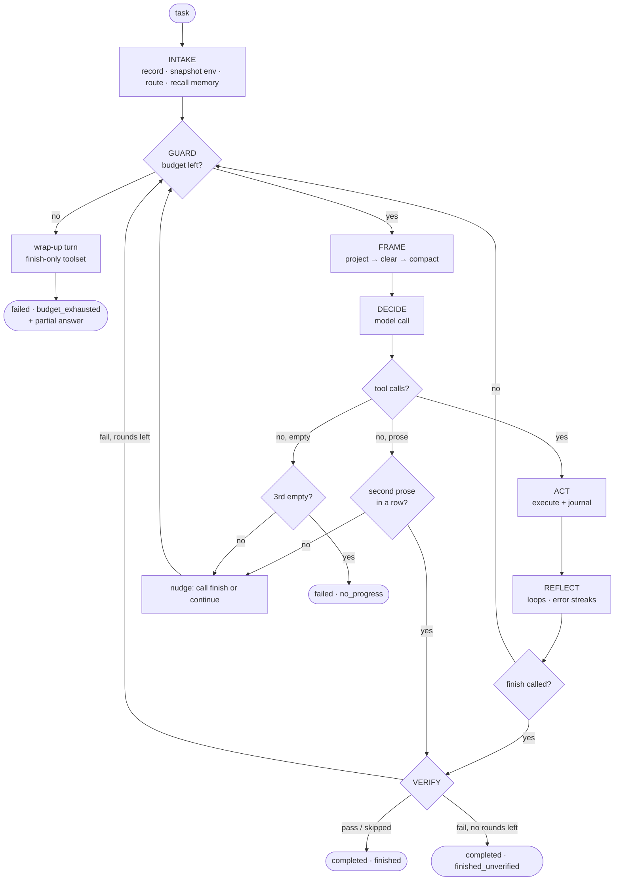

# 03 — Execution Model: How Polymath Executes Any Task

> Status: **Implemented** · Code: `kernel/agent.py`, `kernel/router.py`, `kernel/verifier.py`, `kernel/prompts.py`

This is the answer to "how does it execute *any* task?". There is **one universal algorithm** — the same loop for a one-line question and a two-hour engineering job. What changes between tasks is not the algorithm but the context it is given (hints, skills, budgets) and the tools the model chooses.

---

## 1. The universal algorithm

```text
EXECUTE(task):
  1  INTAKE      record task.submitted (immutable), snapshot environment,
                 classify (router) → hints + relevant skills, recall long-term memories
  2  LOOP until terminal:
  3     GUARD    budgets (turns · tokens · wall-time · tool-calls); warn at 80 %, wrap up at 100 %
  4     FRAME    context = project(event log) → clear old outputs → compact if needed
  5     DECIDE   model(system, context, tools) → text and/or tool calls        [journaled]
  6     ACT      execute calls (parallel-safe groups concurrently, rest in order) [journaled]
  7     REFLECT  health checks: identical-call loops, error streaks, truncated output
  8     if finish(answer):
  9        VERIFY  verify_command → exit 0?   or   judge(answer, artifacts, criteria)
 10        if pass or rounds exhausted → DELIVER (task.completed)
 11        else feed the failure back → continue LOOP
 12     if prose without tool calls: nudge once; accept on repeat (text_answer)
 13  DELIVER     RunResult{state, stop_reason, answer, artifacts, usage, verification}
```

The model sees a system prompt that encodes the same method at the *cognitive* level — **Understand → Plan → Act → Verify → Deliver** ([prompts.py](../polymath/kernel/prompts.py)). The harness enforces the parts that must not depend on the model's diligence: bounds, journaling, verification, termination.



---

## 2. Phase-by-phase specification

### 2.1 Intake
| Step | What happens | Why |
|---|---|---|
| Record | `task.submitted` stores the full `TaskSpec`, the **exact system prompt**, the tool list and the model | Resume and replay must reconstruct the original conditions. |
| Snapshot | Task message includes: date, OS, Python version, available CLIs (git, rg, jq, node…), workspace path and a ≤60-entry listing | Saves the model 2–4 discovery turns on every task. |
| Route | `heuristic_profile` → category, complexity, parallelisable, relevant skills | Converts into *hints* only ("Relevant skills: data-analysis — load them first"; "write a plan with todo"; "consider delegate"). |
| Recall | BM25 over long-term memory; memories scoring ≥ 1.5 are included | Carries user preferences and lessons across sessions. |

The system prompt contains no task data (cache-stable); everything above goes in the first user message.

### 2.2 Guard (budgets)
Checked before **every** model call against the task's `Budget`:

| Budget | Default | At 80 % | At 100 % |
|---|---|---|---|
| `max_turns` | 80 | one-time harness warning: "prioritise, verify, finish soon" | wrap-up turn, then `failed/budget_exhausted` |
| `max_tokens` (incl. sub-agents) | 3 000 000 | same | same |
| `max_wall_s` | 3600 | same | same |
| `max_tool_calls` | 400 | same | same |

**Wrap-up turn:** the model is asked for its best final answer with *only* the `finish` tool available; if it ignores that, a second attempt forces `finish` via a named `tool_choice`; if that also fails, the kernel synthesises a partial answer from the plan state and the last progress messages. An exhausted run therefore always returns something useful (test: `test_wrap_up_forces_finish_then_synthesises`).

### 2.3 Frame (context)
See [05-context-engineering.md](05-context-engineering.md). Output: a message list guaranteed to fit `window − max_output_tokens`, with every tool call paired to its result.

### 2.4 Decide
One `ChatRequest` with the stable system prompt, the framed context and the deterministic tool list. The gateway handles transient faults, protocol differences and fail-over; the kernel only ever sees a normalised `ModelResponse` or a typed `ModelError`.

### 2.5 Act
- Calls are executed by the registry: argument JSON repaired if possible, schema-validated with lenient coercion, timed, exceptions captured, output clipped (head + tail) and spilled to a file when large.
- **Parallelism rule:** maximal runs of *consecutive* parallel-safe calls (`read_file`, `glob`, `grep`, `fetch_url`, `memory`, `load_skill`) run concurrently; everything else runs in order. Results are journaled in call order, so the transcript is deterministic regardless of completion order.

### 2.6 Reflect (health checks)
| Detector | Trigger | Intervention |
|---|---|---|
| Identical-call loop | same (tool, args, output) ≥ 3× in last 10 calls | one message: "repeating it will not change the outcome — try a different approach" |
| Error streak | 4 consecutive tool errors | "pause and diagnose: paths, cwd, argument formats" |
| Output cut-off | `finish_reason == "length"` | "produce large content in smaller pieces" |
| Prose instead of action | first prose-only reply | "call finish with it, or continue with tools" |
| Empty reply | empty content, no calls | "continue"; 3 in a row → `failed/no_progress` |

### 2.7 Verify
| Mode (`cfg.verify`) | Verification used |
|---|---|
| `auto` (default) | `verify_command` if given; else the criteria judge if `acceptance_criteria` given; else none |
| `always` | as auto, and the judge checks the instruction itself when there are no criteria |
| `off` | never |

Failures are returned as a `[verifier]` message with the command output tail or the judge's failed criteria. After `max_verify_rounds` (2) the last answer is accepted with `stop_reason = finished_unverified` — verification improves results but can never deadlock a run.

### 2.8 Deliver
`RunResult` = `state` (`completed` | `failed`), `stop_reason`, `answer`, `artifacts`, `usage` (including all sub-agents), `turns`, `tool_calls`, `duration_s`, `verification[]`, `error`, `models_used`.

---

## 3. Stop conditions (complete list)

| `state` | `stop_reason` | Meaning |
|---|---|---|
| completed | `finished` | `finish` called; verification passed or not applicable |
| completed | `text_answer` | Model answered in prose twice (or once in `minimal` mode); treated as final |
| completed | `finished_unverified` | Verification still failing after max rounds; answer accepted, failure recorded |
| failed | `budget_exhausted` | A budget ran out; partial answer from the wrap-up turn |
| failed | `model_error` | All models in the chain failed (after retries and fail-over) |
| failed | `no_progress` | Three consecutive empty replies |
| failed | `crash` | A sub-agent raised an unexpected exception (parent continues) |

A `failed` session is **resumable** (`polymath resume <id>`): e.g. after a provider outage, resume continues from the last journaled event.

---

## 4. Error-handling matrix

| Failure | Where caught | Recovery | Model sees |
|---|---|---|---|
| 429 / 5xx / idle timeout / broken stream / malformed 200 | gateway | backoff with jitter (honours `Retry-After`), ≤ `max_retries`; streaming makes the timeout an *idle* timeout, so long generations are never cut ([ADR-010](adr/ADR-010-streaming-idle-timeouts.md)) | nothing |
| Endpoint rejects `tools` | gateway | sticky downgrade to text protocol, immediate retry | nothing |
| Model unhealthy (retries exhausted, 404, 401) | `FallbackClient` | next model; breaker opens after 3 failures for 90 s | nothing |
| Context overflow (400 "maximum context length") | kernel | force compaction, shrink believed window 20 %, retry (≤ 3) | compacted context |
| Invalid tool-call JSON | protocols + registry | lenient repair; else corrective error result | "arguments were not valid JSON…" |
| Unknown tool | registry | error result listing available tools | "unknown tool 'x'. Available: …" |
| Schema violation | registry | coercion where unambiguous; else precise error with JSON path | "$.items[1].status: must be one of…" |
| Tool raises | registry | captured with traceback tail | "tool 'x' crashed: …" |
| Command timeout | terminal | SIGINT → SIGTERM → SIGKILL on the command's own processes; shell kept | "[TIMEOUT …] run long jobs in background" |
| Shell exits / wedges | terminal | new shell in the same cwd | "[shell was restarted; state lost]" |
| Process crash / `kill -9` | next process | `resume`: torn-tail repair, re-execute pending calls | continues seamlessly |

---

## 5. How different kinds of work flow through the same loop

The loop is identical; the *trajectory* differs. Observed trajectories from live runs (see [evaluation/RESULTS.md](evaluation/RESULTS.md)):

| Work type | Typical trajectory | Harness features that matter most |
|---|---|---|
| Implement code | load skill → write file → run tests → fix → finish | persistent terminal, exact edits, verification discipline |
| Debug | run failing tests → grep/read → hypothesise → edit → re-run full suite | error messages with closest-match hints, test output clipping |
| Data analysis | profile file (head/wc) → script → cross-check totals → write output → read back | code-backed computation, output spill files |
| Terminal ops | inspect → pipeline/script → verify listing/checksum | background processes, timeout semantics |
| Research | glob/grep corpus → read candidates → resolve conflicts by date → notes → answer | parallel read-only calls, notes, delegation |
| Writing | read sources → write → mechanical checks (`wc -w`, grep headings) → finish | skills (`technical-writing`), judge verification |
| Q&A | answer directly → finish | text-answer handling, low budget |
| Long projects | todo plan → iterate per item → compaction as needed | todo/notes survive compaction; budget warnings |
| Breadth research | delegate N sub-questions → synthesise reports | sub-agents with fresh contexts; usage aggregation |

---

## 6. Autonomy modes

| Mode | Selected by | Control flow | Use when |
|---|---|---|---|
| **Agent (full)** | default | model decides each step within harness guards | open-ended tasks |
| **Agent (minimal)** | `--mode minimal` | bare loop: 5 tools, no skills/memory/hints/verification/nudges | ablation baseline |
| **Delegating agent** | model calls `delegate` | orchestrator–workers, dynamic | independent sub-tasks |
| **Workflow** | `polymath workflow <name>` | code decides steps; LLM/agent only at the leaves; journaled | repeatable pipelines (fix-until-green, research-report, implement-review) |
| **Chat** | `polymath chat` | multi-turn: each user message continues the same session | interactive work |

The choice between them is the determinism question — see [08-determinism.md](08-determinism.md).

---

## 7. Worked example (real trace, abridged)

Task: *"Write primes.py that prints the number of primes below 1,000,000 and their sum, run it and tell me both numbers."* — model `z-ai/glm-5.3`.

```text
 0.00s invoke_agent main [25.62s]
 0.00s   chat z-ai/glm-5.3 [6.49s] in=3,533 out=363     → load_skill(python-engineering)
 6.50s   chat z-ai/glm-5.3 [3.97s] in=3,899 out=335     → write_file(primes.py)       # numpy-based
10.47s   chat z-ai/glm-5.3 [1.27s] in=4,214 out=66      → bash(python3 primes.py)     # ModuleNotFoundError: numpy
11.76s   chat z-ai/glm-5.3 [2.98s] in=4,437 out=313     → write_file(primes.py)       # stdlib bytearray sieve
14.75s   chat z-ai/glm-5.3 [0.96s] in=4,796 out=67      → bash(python3 primes.py)     # 78498, 37550402023
15.76s   chat z-ai/glm-5.3 [5.91s] in=4,994 out=352     → bash(independent odd-only sieve)  # cross-check
21.71s   chat z-ai/glm-5.3 [3.91s] in=5,351 out=308     → finish("78,498 primes; sum 37,550,402,023 …")
```

Note the environment-driven recovery (numpy missing → stdlib) and the unprompted independent cross-check — the verification discipline from the system prompt at work.
