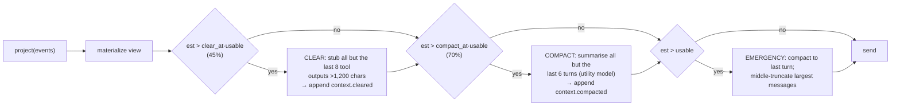

# 05 — Context Engineering

> Status: **Implemented** · Code: `polymath/context/` · Tests: `tests/test_context.py`

Context is the agent's working memory and its most expensive resource. Model recall degrades as the window fills ("context rot"), every token costs money and latency, and a single runaway tool output can blow the window. The context engine's job each turn is to assemble **the smallest high-signal view that lets the model take the next correct action** — and to guarantee it fits.

---

## 1. Anatomy of the prompt

```text
┌───────────────────────────── cache-stable prefix ─────────────────────────────┐
│ [system]  Polymath system prompt (method, principles, skills index)  ~1.0k tok │
│ [tools]   14 tool specs, sorted by name                               ~2.9k tok │
├──────────────────────────────── task anchor ──────────────────────────────────┤
│ [user]    Task · context · criteria · environment snapshot · memories · hints  │  pinned forever
├──────────────────────────────── working set ──────────────────────────────────┤
│ [user]    [Context summary …]   (only after compaction)                        │
│ [assistant/tool]*  recent turns; old tool outputs possibly stubbed             │
│ [user]    harness / verifier messages                                          │
└────────────────────────────────────────────────────────────────────────────────┘
          reserved for output: max_output_tokens (default 16 384)
```

**Budget:** `usable = window − max_output_tokens`, where `window` comes from `context_window` or the per-model table in `config.py` (e.g. GLM-5.3: 200k; Nemotron-3: 256k).

---

## 2. Pipeline (every turn)



| Stage | Trigger | Cost | Loss | Recorded as |
|---|---|---|---|---|
| Clear | estimate > 45 % of usable | free | old tool *outputs* (calls and reasoning kept; first 300 chars kept) | `context.cleared{upto_seq}` |
| Compact | estimate > 70 % | one utility-model call (~2–4 s) | older turns → structured summary | `context.compacted{upto_seq, summary}` |
| Emergency | still > 100 % | free | middle of the largest messages in *this request only* | not recorded (view-only) |

Because clear/compact are **events**, the view is reproducible on resume and replay, and it changes only at those events — see §4.

---

## 3. Algorithms

### 3.1 Clearing
```text
tool_entries = tool results after the last compaction point
if len(tool_entries) ≤ keep_recent_tool_results: no-op
boundary = seq of the (keep+1)-th most recent tool result
victims  = tool results in (cleared_upto, boundary] with > clear_min_chars
if victims: append context.cleared{upto_seq: boundary}
```
Rationale: tool outputs are the bulk of agent context (a single `cat` can be 20k tokens) and are *re-derivable* — the stub tells the model to re-run the tool if needed. The model's own reasoning and the call arguments are kept, so the trajectory stays intelligible.

### 3.2 Compaction
```text
visible = entries after the last compaction (task entry excluded)
turn_starts = indices of assistant messages in visible
if len(turn_starts) ≤ keep_turns: no-op
cut = turn_starts[-keep_turns]                  # always a turn boundary → pairs intact (I2)
summary = summarise(previous summary + transcript(visible[:cut]) + plan + notes)
append context.compacted{upto_seq: visible[cut-1].seq, summary}
```
**Summary schema** (enforced by the summariser prompt, `context/engine.py::SUMMARY_SYSTEM`):
`## Task progress` · `## Key facts and values` (verbatim numbers, paths, ids) · `## Files` · `## Decisions and rationale` · `## Problems encountered` · `## Next steps`. The live plan and the agent's notes file are appended verbatim, because they are the agent's own structured memory and must not be paraphrased.

**Summariser input bounds:** transcript tool outputs are cut to 2,000 chars each and the whole transcript to 240k chars, so compaction itself can never overflow.

**Fallback:** if the utility model fails or returns < 80 chars, a deterministic digest (thoughts, calls, first line of each result) is used — compaction never blocks progress.

### 3.3 Emergency truncation
Sort messages (excluding the pinned task) by length; middle-truncate the largest (keep head and tail halves, ≥ 2,000 chars) until the estimate fits. Applied to the request only.

### 3.4 Context overflow from the provider
If the endpoint still returns a context-length error (estimate was optimistic), the kernel shrinks its believed window by 20 %, forces compaction and retries (≤ 3 times). Test: `test_context_overflow_triggers_compaction_and_retry`.

---

## 4. Cache-shape discipline

Provider prompt caches (and KV-cache reuse in self-hosted vLLM/NIM) only help when the *prefix* is byte-identical across requests. Rules:

1. **System prompt is task-independent** — no dates, paths, or task data (invariant I7).
2. **Tool specs are sorted by name** and never vary within a session.
3. **The task anchor never moves** — it stays message #1 after compaction.
4. **History is append-only between rewrite events.** Clearing happens in batches (not a sliding window each turn), so the prefix changes only on `context.cleared`/`context.compacted`, roughly once per ~10+ turns instead of every turn.
5. **Ephemeral guidance is appended**, never inserted earlier.

The *Harness Effect* study (arXiv 2607.06906) attributes a large part of orchestration-driven cost reduction to exactly this "cache-shape discipline".

---

## 5. Token estimation and calibration

We do not ship tokenizers. `estimate_text = (len + 2·non_ascii) / 3.4 + 1`, `+6` per message, tool-call JSON counted. After every call the kernel feeds `(estimate, usage.prompt_tokens)` into a per-model EMA (`α = 0.3`) and future estimates are multiplied by the learned ratio (floored at 0.5).

Measured on the v1 GLM-5.3 run (206 calls): first call of a session **estimate/actual median 1.13** (range 1.06–1.21 — conservative, as intended: over-estimating triggers compaction slightly early rather than overflowing); subsequent calls **median 1.07, p10 0.98, p90 1.11**.

---

## 6. Just-in-time context (instead of pre-loading)

| Mechanism | What it does |
|---|---|
| Environment snapshot | Cheap facts up front (≤ 60 file names, available CLIs) instead of discovery turns. |
| `read_file` paging | 2,000-line pages with line numbers; the model asks for more only if needed. |
| `grep` / `glob` | Locate before reading; output capped at 200 matches. |
| Output spill files | Clipped outputs keep head + tail; the full text is saved to `outputs/<call>.txt` and its path is shown, so the model can `grep` the middle later. |
| Skills | Only name + one-line description are in the prompt; bodies load on demand. |
| Sub-agents | Bulky exploration happens in a child context; only its report (≤ ~400 words) returns. |

---

## 7. Structured memory that survives compaction

| Store | Scope | Survives compaction because… |
|---|---|---|
| `todo` plan | agent | re-appended verbatim to every summary ("Current plan (live)") |
| `notes` scratchpad | agent (file) | re-appended verbatim to every summary |
| Task anchor | agent | pinned as message #1 |
| Long-term memory | cross-session | lives outside the session; recalled at intake |

---

## 8. Configuration

| Key | Default | Meaning |
|---|---|---|
| `context_window` | per model | override the window (used by context-stress evals) |
| `max_output_tokens` | 16 384 | reserved for the response |
| `clear_at` | 0.45 | clearing threshold (fraction of usable) |
| `compact_at` | 0.70 | compaction threshold |
| `keep_recent_tool_results` | 8 | tool outputs never cleared |
| `keep_recent_turns` | 6 | turns kept verbatim on compaction |
| `clear_min_chars` | 1 200 | outputs shorter than this are never stubbed |
| `utility_model` | nemotron-3.5-lightning | summariser |
