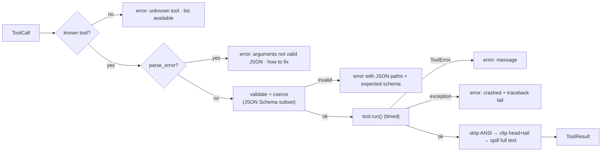

# 06 — Tool System

> Status: **Implemented** · Code: `polymath/tools/` · Schemas: `spec/schemas/tool-*.schema.json` · Tests: `tests/test_tools.py`

## 1. Contract

```python
class Tool:
    name: str                      # ≤ 64 chars, snake_case
    description: str               # written FOR THE MODEL: when to use, what it returns, limits
    parameters: dict               # JSON Schema (type: object)
    parallel_safe: bool = False    # read-only & thread-safe ⇒ may run concurrently
    terminal: bool = False         # calling it can end the run (finish)
    def run(self, args: dict, ctx: ToolContext) -> str | ToolOutput: ...
```

`ToolContext` gives a tool: `workspace`, `session_dir`, `agent_id`, `config`, `events`, `state` (per-agent dict), `shell()` (lazy persistent shell), `outputs_dir` (spill files), and late-bound callbacks `spawn_subagents` and `ask_user`.

A tool **returns** text (or `ToolOutput(text, is_error, meta, truncated)`) and **raises** `ToolError` for expected, model-actionable failures. Any other exception is a bug in the tool and is still captured.

## 2. What the registry does around every call



| Concern | Behaviour |
|---|---|
| **Argument repair** | Done earlier by the protocol decoder: code fences, surrounding prose, trailing commas, Python literals, single quotes (`jsonutil.loads_lenient`). |
| **Validation** | `type` (incl. unions), `required`, `properties`, `additionalProperties:false`, `enum`, `const`, `min/max`, `minLength/maxLength`, `minItems/maxItems`, `items`, `default`. |
| **Lenient coercion** | Unambiguous only: `"5"→5`, `"true"→true`, `5→"5"`, `'[..]'→[..]`, scalar→`[scalar]`, `'{..}'→{..}`. Each coercion is recorded in `meta.coercions`. `true` is never accepted as an integer. |
| **Output budget** | `max_tool_output_chars` (24,000): keep 55 % head + 45 % tail, insert `[... N characters omitted; full output saved to <path> ...]`. |
| **Timing** | `duration_s` on every result; also exported as `execute_tool` spans. |
| **Error semantics** | `is_error` means *the tool failed* (bad args, crash, timeout). A command that ran and exited non-zero is a successful tool call whose *result* is a failure — this distinction keeps error-streak detection meaningful. |

## 3. Parallel execution

`execute_batch(calls)` scans the model's calls in order; **maximal runs of consecutive parallel-safe calls** run concurrently (`tool_parallelism`, default 8); any other call is a barrier. Results are placed by index, so the journal order equals the call order (invariant I5). Parallel-safe: `read_file`, `glob`, `grep`, `fetch_url`, `memory`, `load_skill`. Example: `[read a, read b, write c, read d, read e]` → `{a‖b}` → `c` → `{d‖e}`.

## 4. Catalogue

| Tool | Parallel | Purpose | Key parameters | Returns / notes |
|---|---|---|---|---|
| `bash` | – | Persistent shell (see [07](07-terminal-subsystem.md)) | `command`, `timeout` (≤1800 s), `restart` | combined stdout/stderr + `[exit code · duration · cwd]` footer |
| `read_file` | ✓ | Paged, line-numbered read; directory listing; binary summary | `path`, `offset`, `limit` | `cat -n` format; "showing lines a–b of N" |
| `write_file` | – | Create/overwrite, creates parent dirs | `path`, `content` | bytes + lines written |
| `edit_file` | – | Exact-string replacement, uniqueness enforced | `path`, `old_string`, `new_string`, `replace_all` | numbered snippet of the edited region; on miss: the most similar region |
| `glob` | ✓ | Find files by pattern (skips `.git`, `node_modules`, venvs, caches) | `pattern`, `path` | sorted relative paths (≤1000) |
| `grep` | ✓ | Regex content search (ripgrep, pure-Python fallback) | `pattern`, `path`, `glob`, `ignore_case`, `context`, `max_results` | `path:line:text` |
| `todo` | – | Explicit plan (full replacement) | `items[{content,status}]` | rendered checklist; `plan.updated` event |
| `notes` | – | Durable scratchpad (file) | `action: append/read/write`, `content` | survives compaction verbatim |
| `finish` | – | End the task | `answer`, `artifacts[]` | triggers verification |
| `ask_user` | – | Clarifying question (interactive) or "assume and state it" | `question` | user answer or instruction to assume |
| `fetch_url` | ✓ | HTTP GET → readable text (HTML→text with headings & links; JSON pretty-printed) | `url`, `max_chars` | clipped text + spill file |
| `memory` | ✓ | Cross-session memory | `action: save/search/list/delete`, … | BM25 hits with ids and dates |
| `load_skill` | ✓ | Load a playbook on demand | `name` | SKILL.md body + resource list |
| `delegate` | – | Parallel sub-agents with fresh contexts | `tasks[{task, context}]` (1–8) | one report per sub-agent |

The **minimal** profile (ablation baseline) is `bash`, `read_file`, `write_file`, `edit_file`, `finish`.

## 5. Why exact-string edits

Line-number edits drift after the first change; unified diffs fail on context mismatch; whole-file rewrites waste tokens and silently drop content. Exact `old_string → new_string` with a uniqueness rule is the most reliable format for current models ([ADR-008](adr/ADR-008-exact-string-edits.md)). The failure mode — "not found" — is made cheap to recover from by returning the most similar region with line numbers (`difflib` ratio ≥ 0.6). We deliberately do **not** fuzzy-apply: a guessed edit is worse than a precise error.

## 6. Tool design guidelines (for new tools)

1. **One job, no overlap.** If two tools could plausibly serve a request, merge or sharpen them.
2. **Describe for the model**: when to use, when *not* to, what comes back, limits (sizes, timeouts). The description is part of the prompt.
3. **Return decision-ready text**: counts, paths, a footer with status. Never return raw binary or megabytes.
4. **Fail informatively**: say what was wrong and what to do instead ("did you mean …", "use write_file to create").
5. **Be idempotent** where possible (resume is at-least-once).
6. **Mark parallel-safe only if read-only.**
7. **Keep schemas flat** and use enums for modes; add `default`s.

## 7. Code mode (programmatic tool calling)

For data-heavy multi-step work the most token-efficient pattern is to let the model **write a program that does the work** rather than calling tools one by one and pulling every intermediate result into context (Anthropic reported 150k → 2k tokens on a Drive→Salesforce task, a 98.7 % reduction). Polymath gets this for free from the terminal: the model writes a `python3 - <<'EOF' … EOF` script, intermediate data stays in the process, only the final result returns. The system prompt's "compute with code" principle and the `data-analysis` skill push the model toward this pattern. Observed on `data-sales-report` (GLM-5.3, v1 run): the agent profiled the file with `head`, explored it with two inline Python scripts, wrote `analyze.py`, then cross-checked every figure with an independent 44-line script. The largest tool output in the whole run was 1,636 characters — the 3,000-row dirty CSV never entered the context (11 turns, ~70k tokens total).

## 8. MCP mapping

Polymath's tool contract maps directly onto MCP (spec 2026-07-28):

| Polymath | MCP 2026-07-28 |
|---|---|
| `Tool.spec()` (name, description, JSON Schema) | `tools/list` entry (`inputSchema` accepts any JSON Schema 2020-12) |
| `ToolRegistry.specs()` sorted | servers SHOULD return tools in deterministic order for prompt-cache hits |
| `ToolResult.output` / `meta` | `content` / `structuredContent` |
| `is_error` | `isError` |
| Long-running tools | `io.modelcontextprotocol/tasks` extension (`tasks/get` polling) |
| `ask_user` | Multi Round-Trip Requests (`InputRequiredResult` → retry with `inputResponses`) |

An MCP adapter is a `Tool` subclass per remote tool whose `run` performs `tools/call` over Streamable HTTP (stateless since 2026-07-28, so no session management is needed). It is on the [roadmap](16-roadmap.md); the registry needs no changes to host it.
