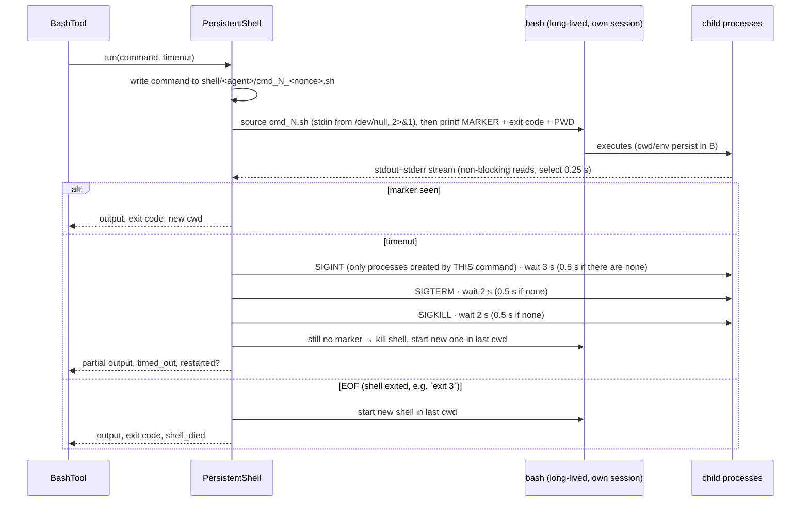

# 07 — Terminal Subsystem

> Status: **Implemented; carried into v2** ([ADR-013](adr/ADR-013-keep-polymath-terminal.md), 14/14 in the six-shell bake-off [R3](research/03-terminal-bakeoff.md)) · Code: `polymath/tools/terminal.py`, `polymath/v2/terminal.py` · Decision: [ADR-001](adr/ADR-001-terminal-as-primary-actuator.md) · Tests: `tests/test_tools.py::TestPersistentShell`

## 1. Should an agent have a terminal? — Yes, as its primary actuator.

**The question:** add a terminal, or give the agent only curated, special-purpose tools?

**Answer: add it, make it persistent, and make it the center of the toolset.**

| Argument | Evidence |
|---|---|
| **Coverage.** A shell exposes the entire OS toolchain — compilers, interpreters, package managers, git, curl, databases, archivers, text processing — through one tool. Curated tools cover only what someone anticipated. | In the v1 GLM-5.3 run, `bash` was 43 % of all tool calls (110/253) and was used for testing, packaging, git, HTTP checks, SQL, data scripts and search. |
| **Models are fluent in it.** Shell usage is massively represented in training data; the model needs no documentation for `tar --exclude` or `sort -k2 -nr`. | Terminal-Bench 2.x exists precisely because the terminal is where frontier agents are evaluated; leaders now exceed 80 %. |
| **Token efficiency ("code mode").** One script replaces dozens of tool round-trips and keeps intermediate data out of the context. | See [06 §7](06-tool-system.md#7-code-mode-programmatic-tool-calling). |
| **Verification.** The terminal is how an agent *checks* its work: run tests, re-read outputs, recompute numbers. | Every verified pass in the eval used the terminal for its check. |
| **Composability with sandboxes.** A terminal needs only a POSIX environment, so the same harness runs on a laptop, in a container, or in a microVM (Firecracker ~125 ms boot; gVisor). | Brain/hands decoupling ([02](02-system-architecture.md)). |

**What we deliberately kept as dedicated tools** despite the terminal: file read/write/edit (structured, line-numbered, exact-edit semantics and better errors than `sed`), glob/grep (bounded, `.gitignore`-aware output), and the control tools (`todo`, `notes`, `finish`, `delegate`) that the harness must observe.

**Persistent vs stateless.** A stateless `subprocess.run` per command is simpler but loses `cd`, exported variables, activated virtualenvs and shell functions — the model then prefixes every command with `cd … && source …` and gets confused when it forgets. A persistent shell matches how the model thinks a terminal works. The cost is complexity in completion detection, timeouts and recovery, which this subsystem solves.

---

## 2. Design

### 2.1 Mechanisms and why

| Mechanism | Problem it solves |
|---|---|
| **Command written to a script and `source`d** | Heredocs, multi-line programs and quoting work naturally; an unbalanced quote or syntax error is confined to that `source` and cannot leave the shell waiting for more input. |
| **`< /dev/null` on the source** | Nothing can block on stdin (`read`, `python` REPL, `git commit` without `-m`, prompts). |
| **Per-command random marker** printed with `$?` and `$PWD` | Reliable completion detection and exit status even if the command prints anything; cwd tracking for restarts. |
| **Per-agent scratch dir + nonce in script names** | Parallel sub-agents never collide. (A real race found by the delegation test and fixed.) |
| **`start_new_session=True`** | The shell is isolated from the harness's process group and terminal signals. |
| **Descendant snapshot before each command** | Timeouts signal only processes *this* command created; a server started earlier with `nohup … &` survives. |
| **Escalation SIGINT → SIGTERM → SIGKILL → shell replacement** | Graceful first (lets programs clean up), certain in the end (even a builtin busy-loop `while true; do :; done` is handled by replacing the shell). When a step has no child process to signal, the shell itself is busy and waiting can't help, so that step's grace drops to 0.5 s. The v2 bake-off measured 9 s before this change and 3.5 s after it, for a 2 s timeout ([R3](research/03-terminal-bakeoff.md) §6). |
| **Hermetic environment** | `TERM=dumb`, `PAGER=cat`, `GIT_PAGER=cat`, `GIT_EDITOR=true`, `GIT_TERMINAL_PROMPT=0`, `PYTHONUNBUFFERED=1`, `PIP_PROGRESS_BAR=off`, `DEBIAN_FRONTEND=noninteractive`, `NO_COLOR=1`, UTF-8 locale; harness credentials (`*_API_KEY`, `*_TOKEN`, `*_SECRET`) are not inherited — the agent's shell gets only what the task needs. |
| **Bounded capture** | 2 MB frozen head + 2 MB rolling tail; the middle is counted and dropped. A 30 MB flood is processed in 0.33 s with ~4 MB resident. |
| **Output hygiene** | ANSI/OSC escape stripping; `\r` progress bars collapsed to their final state; invalid UTF-8 replaced. |

### 2.2 Semantics the model is told (tool description)

- State persists; stdin is `/dev/null`; use non-interactive flags.
- Long-running servers **must** be backgrounded with output redirected (`nohup CMD > log 2>&1 &`), then polled.
- Default timeout 180 s, max 1800 s via the `timeout` parameter.
- Output over ~24k characters is clipped (head and tail kept) and the full text saved to a file.

### 2.3 Honest limitations

| Limitation | Consequence | Mitigation |
|---|---|---|
| On timeout, the interrupted *process* dies but later commands **in the same script** still run (bash semantics). | `sleep 30; echo after` prints `after` after the interrupt. | The result is still flagged `TIMEOUT`; loops that keep spawning children escalate to shell replacement. |
| Background processes that inherit stdout can interleave output into later commands. | Noisy output. | Tool description mandates redirecting background output. |
| Descendant tracking reads `/proc`. | Linux only. | macOS support would use `pgrep -P`; on the roadmap. |
| A killed shell loses exported variables and functions. | The model must re-establish them. | The result says so explicitly and restarts in the same cwd. |
| No PTY. | Full-screen TUIs (`vim`, `top`) don't work. | Intentional: agents should use non-interactive equivalents. |

---

## 3. Verified behaviour (test matrix)

All rows are automated in `tests/test_tools.py::TestPersistentShell` (plus an adversarial manual run recorded during development):

| Scenario | Expected | Result |
|---|---|---|
| `cd a/b && export FOO=bar && f(){…}` then `pwd; echo $FOO; f x` | state persists | ✅ |
| Heredoc Python script + quotes | runs, output exact | ✅ |
| `echo 'unclosed` | error rc=2, shell stays usable | ✅ |
| `read x` | gets EOF immediately, no hang | ✅ |
| `echo err 1>&2`, function returning 3 | merged streams, rc=3 | ✅ |
| `printf '10%\r50%\r100%\n'` | `100%` only | ✅ |
| `sleep 30` with 1 s timeout while a background `sleep 60` runs | timed out < 6 s, background process alive | ✅ |
| `exit 7` | rc=7, `shell_died`, next command runs in same cwd | ✅ |
| `yes … \| head -c 20MB` | bounded capture, `dropped_bytes > 0`, tail preserved | ✅ |
| `while true; do :; done` with 0.5 s timeout | shell replaced, next command works | ✅ |
| Two sub-agents running commands concurrently | no script collisions | ✅ (regression test for a real race) |
| HTTP server started with `nohup`, then a timed-out command, then `curl` | server still answers (HTTP 200) | ✅ (manual adversarial run) |

---

## 4. Configuration

| Key | Default | Meaning |
|---|---|---|
| `shell` | `/bin/bash` | shell binary |
| `shell_timeout_s` | 180 | default per-command timeout |
| `shell_max_timeout_s` | 1800 | cap for the `timeout` argument |
| `max_tool_output_chars` | 24 000 | model-facing output budget |
| `hermetic_env_strip` | `*_API_KEY, *_TOKEN, *_SECRET` | environment variables not inherited by the agent shell |
