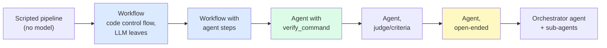

# 08 — Determinism

> Status: **Implemented** · Decision: [ADR-003](adr/ADR-003-determinism-boundary.md) · Code: `kernel/workflow.py`, `gateway/testing.py`, `events.py`

## 1. The question

LLM sampling is non-deterministic, and even at temperature 0 hosted inference is not bit-reproducible (batching, kernel non-associativity, silent model updates). **Should an agent be deterministic?** Not everywhere — that would remove the judgement we want from the model. But everything *around* the judgement can and should be deterministic, and a system should let you choose how much control flow the model owns.

**Polymath's answer: deterministic harness, stochastic leaves, with a dial.**

## 2. Where determinism lives

| Layer | Deterministic? | How |
|---|---|---|
| Control flow of the loop | ✅ | Plain code: budgets, stop conditions, verification rounds, nudges, loop detection. |
| Termination | ✅ | Hard budgets checked before every model call; explicit `finish`; wrap-up turn. |
| Context construction | ✅ given the log | Pure projection of the event log; clear/compact decisions are journaled events, not re-computed guesses. |
| Tool execution order | ✅ | Call order preserved; parallel groups are index-merged. |
| Tool list & system prompt | ✅ | Sorted, task-independent (also maximises cache hits). |
| Retries/backoff | ✅ in tests | Injected RNG and `sleep` → exact reproduction of retry schedules in unit tests. |
| Verification by command | ✅ | Exit status of a command. |
| Model's next action | ❌ | Sampled. Mitigations: low temperature (0.2–0.3 default), optional `seed`, explicit plan tool, verification. |
| Verification by judge | ❌ | Temperature 0, structured JSON output, criteria listed; used only when no command exists. |

## 3. The autonomy dial



**More deterministic ←→ more autonomous.** Move left when the procedure is known and must be repeatable/auditable; move right when the path is unknown and judgement dominates.

### Decision guide

| If… | Use |
|---|---|
| The steps are known and stable (CI repair loop, report pipeline) | **Workflow** (`polymath workflow …`) |
| The goal is checkable by a command (tests, linters, `diff`) | **Agent + `verify_command`** |
| The goal is checkable only by reading (docs, summaries) | **Agent + `acceptance_criteria`** (judge) |
| The path is unknown and exploratory | **Agent** (default) |
| The work splits into independent parts | **Agent with `delegate`**, or a workflow with a parallel agent step |

## 4. Deterministic workflows

A workflow is Python control flow whose leaves may call a model or an agent:

```python
Workflow("fix-until-green", [
    Loop("repair",
         [Step("test", lambda c: c.shell(c.inputs["cmd"])),
          Step("fix",  lambda c: c.agent(f"Fix: {c.last('test')['output']}", name="fix"),
               when=lambda c: c.last("test")["rc"] != 0)],
         until=lambda c: c.last("test")["rc"] == 0, max_iterations=4),
    Step("final", test, when=lambda c: c.last("test")["rc"] != 0),
])
```

**Journaled like durable-execution activities (Temporal/Restate/DBOS):** each step's output is appended as `workflow.step.completed{step, output}`. Re-running the same workflow with the same `--session` **skips every completed step and reuses its recorded output**, so a crash in step 7 resumes at step 7, and a re-run never repeats expensive or side-effecting work. Rules for step authors: side effects only through `ctx.llm / ctx.agent / ctx.shell`; outputs JSON-serialisable; `when`/`until` predicates read only recorded outputs.

Built-ins:

| Workflow | Shape | Pattern |
|---|---|---|
| `fix-until-green` | test → (fix → test)* | evaluator loop with a deterministic evaluator |
| `research-report` | plan (LLM, JSON) → N parallel agents → synthesise (LLM) → write | orchestrator–workers with fixed fan-out |
| `implement-review` | agent implements → reviewer LLM (JSON) → agent revises, until approved | evaluator–optimiser |

Tests: `TestWorkflows` (loop semantics, `when`, journal skip after a crash).

## 5. Journaled execution and replay

Because every model output is journaled, **a stochastic run becomes a deterministic artifact after the fact**:

| Capability | Mechanism | Guarantee |
|---|---|---|
| Resume | re-project the log; re-execute pending calls | identical context to the moment of the crash (I6) |
| Replay | `ReplayClient` serves recorded responses; tools re-run | same tool trajectory if the environment is the same (`test_replay_reproduces_run`) |
| Strict replay | request fingerprints compared | first divergence raised with its index |
| Cassettes | `RecordingClient` / `ReplayClient` for any exchange, incl. compaction and judge calls | byte-level reproduction of all model I/O |
| Scripted tests | `ScriptedClient` | the entire kernel is tested without any model |

## 6. Reducing variance of the stochastic part

1. **Low temperature by default** (0.2–0.3 per model, `model_params`), `seed` passed when configured.
2. **Explicit structure**: plan (`todo`), explicit finish, verification — so variance in phrasing doesn't become variance in outcome.
3. **Verification closes the loop**: a wrong result with a failing check gets another attempt.
4. **Measure variance**: `evals.runner --repeat k` reports per-task pass rates across repeats (pass@1 averaged). Results in [evaluation/RESULTS.md](evaluation/RESULTS.md).
