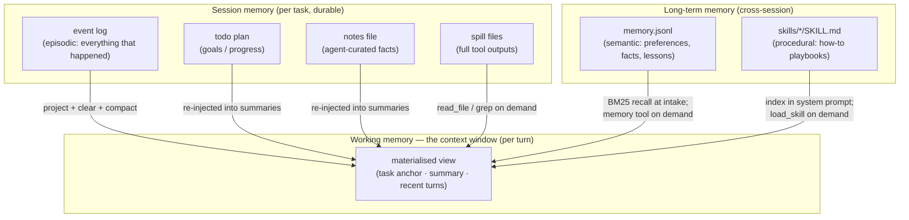

# 09 — Memory Architecture

> Status: **Implemented** · Code: `context/`, `tools/planning.py`, `tools/memory_tool.py`, `memory/store.py`, `tools/skills.py`

Agents need several kinds of memory with different lifetimes, costs and write policies. Polymath maps the classic cognitive taxonomy onto concrete stores:

| Memory | Store | Written by | Read by | Lifetime | Size control |
|---|---|---|---|---|---|
| **Working** | request messages | context engine | model | one turn | window budget ([05](05-context-engineering.md)) |
| **Episodic** | `events.jsonl` | kernel (every fact) | projection, resume, replay, humans | forever | append-only |
| **Plan** | `plan.updated` events | `todo` | summaries, model | session | small |
| **Scratchpad** | `NOTES.<agent>.md` | `notes` (agent's choice) | summaries, model | session | last 6k chars re-injected |
| **Overflow** | `outputs/*.txt` | registry (clipped outputs) | model via tools | session | on disk only |
| **Semantic** | `memory.jsonl` | `memory save` (agent's choice) | intake recall (score ≥ 1.5, top 3), `memory search` | cross-session | tombstone deletes |
| **Procedural** | `SKILL.md` dirs | humans (or agents writing files) | `load_skill` | permanent | only name+description in prompt |

## Write policies

- **Everything** episodic is written automatically — the agent cannot forget what happened, only lose it from working memory, from which it is recoverable.
- **Scratchpad and semantic memory are written deliberately by the agent**, guided by the tool descriptions: notes for "facts you must not lose in this task", memory for "durable, reusable knowledge — not transient task details".
- **Procedural memory is curated**: 7 built-in skills (python-engineering, debugging, data-analysis, research-synthesis, technical-writing, git-workflow, web-services), extensible via `skill_dirs`.

## Retrieval

- **Semantic:** Okapi BM25 (`k1=1.4, b=0.75`) over lower-cased tokens with stop-words removed; tags counted double. Deterministic, dependency-free, adequate for hundreds–thousands of short memories. Swap in embeddings by implementing `MemoryStore.search` (roadmap).
- **Procedural:** progressive disclosure — the model sees `- name: description` for each skill and loads a body only when relevant. The v1 GLM-5.3 run loaded skills 34 times across 28 tasks (python-engineering 11, data-analysis 10, technical-writing 5, web-services 3, git-workflow 2, research-synthesis 2, debugging 1).

## Observed usage (honest note)

In the v1 core-suite runs, agents **never used `notes` or `memory`**: tasks were short enough (median ~8 turns) that working memory sufficed and no compaction occurred. These stores exist for long-horizon work; their value is exercised by the context-stress evaluation (small forced window) reported in [evaluation/RESULTS.md](evaluation/RESULTS.md), not assumed.
