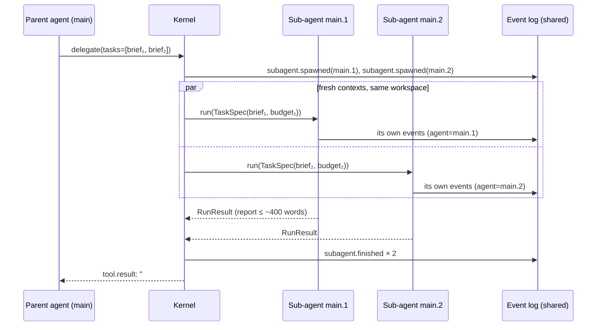

# 10 — Multi-Agent Orchestration

> Status: **Implemented** · Decision: [ADR-004](adr/ADR-004-single-agent-default.md) · Code: `tools/delegate.py`, `kernel/agent.py::_spawn_subagents`, `kernel/workflows_builtin.py`

## 1. Position: single agent by default, sub-agents on demand

Multi-agent systems cost tokens (Anthropic measured ~15× a chat interaction for its research system) and add coordination failure modes. They pay off when work **decomposes into independent threads** or when **exploration would flood the parent's context**; they hurt on tightly coupled work such as most coding. So Polymath runs **one agent**, which may **choose** to delegate — the decision is the model's, informed by the `delegate` tool description and a router hint when a task looks parallelisable.

## 2. Orchestrator–workers via `delegate`

## 3. Delegation contract

| Aspect | Rule |
|---|---|
| **Brief** | Self-contained: goal, relevant paths/facts, constraints, exact return format. The child cannot see the parent's conversation. |
| **Context** | Child starts clean: system prompt + sub-agent addendum ("stay in scope; your `finish` answer is your report") + its brief. |
| **Tools** | Same toolset minus `delegate` once `depth ≥ max_delegation_depth` (default 1 → no grandchildren). |
| **Workspace** | Shared. Briefs must assign disjoint output files. Each child has its own shell and shell scratch dir. |
| **Budget** | `max_turns = min(40, parent)`, `max_tool_calls = min(150, parent)`, `max_tokens = max(150k, parent_remaining / n)`, `max_wall_s = max(120, min(1800, parent_remaining))`. |
| **Parallelism** | `max_parallel_subagents` (default 4) threads; up to 8 briefs per call. |
| **Failure** | A crashing child yields a `failed/crash` report; the parent continues. |
| **Accounting** | Children's usage is aggregated into the parent's `RunResult.usage` and counted against the parent's token budget. |
| **Observability** | Children log to the same session with agent ids `main.1`, `main.2`; their `invoke_agent` spans are children of the parent's span. |

## 4. When to delegate (guidance given to the model)

Delegate: independent research questions; analysing several files/datasets separately; building unrelated components; isolating bulky exploration. Don't delegate: tightly coupled steps, anything needing the parent's accumulated context, trivial lookups.

## 5. Static fan-out: workflows

When the decomposition is known in advance, a workflow is cheaper and more predictable than letting a model decide: `research-report` plans sub-questions (LLM JSON) → runs one agent per sub-question in parallel → synthesises. See [08](08-determinism.md#4-deterministic-workflows).

## 6. Evidence

- Offline: `test_delegation_runs_parallel_subagents` (2 children, disjoint files, usage aggregation = 6 requests), `test_subagent_cannot_delegate_beyond_depth`.
- Live, core suite: agents **never chose** to delegate (0 spawns across 28 GLM-5.3 tasks), including `research-parallel` whose 4 questions were answerable in 5 turns by direct search — a reasonable choice at that scale.
- Live, hard tier: `hard-delegate-research` instructs explicit delegation across 5 product lines; its outcome is reported in [evaluation/RESULTS.md](evaluation/RESULTS.md).

## 7. A2A mapping

Polymath's task model is intentionally aligned with A2A v1.0 (Linux Foundation, 2026), so a Polymath agent can be exposed as — or can call — an A2A agent:

| A2A v1.0 | Polymath |
|---|---|
| Agent Card (`/.well-known/agent-card.json`, skills, security schemes; signed in v1.0) | Generated from the tool list + skills index (roadmap) |
| Task states: submitted, working, input_required, auth_required, completed, failed, canceled, rejected | `task.state` values (subset: submitted, working, input_required, completed, failed, canceled) |
| Messages / Artifacts | `message.user` events / `RunResult.artifacts` |
| Streaming status updates | `EventLog.subscribe` (console renderer is one subscriber) |
| Remote agent as a worker | a `delegate` backend that sends the brief to an A2A server instead of a local `Agent` (roadmap) |
