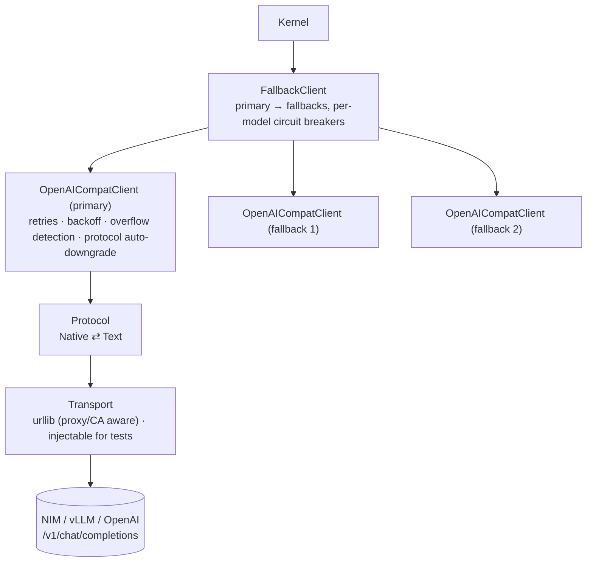

# 11 — Model Gateway

> Status: **Implemented** · Code: `polymath/gateway/` · Tests: `tests/test_gateway.py`, `tests/test_workflow_and_chaos.py::TestChaos`

The gateway makes an unreliable, heterogeneous set of model endpoints look like one reliable function: `complete(ChatRequest) → ModelResponse | ModelError`.

## 1. Layers



## 2. Request / response normalisation

| Field | Normalisation |
|---|---|
| `content` | list-of-parts flattened; `<think>…</think>` moved to `reasoning` (also the "opening tag in template" variant) |
| `reasoning` | `reasoning_content` or `reasoning`; journaled, not re-sent unless `send_reasoning_back` |
| `tool_calls` | arguments parsed leniently; missing/duplicate ids replaced with unique ids; calls smuggled into `content` as `<tool_call>` / `<function=…>` are recovered |
| `usage` | `prompt_tokens`, `completion_tokens`, `prompt_tokens_details.cached_tokens` |
| wire messages | consecutive user messages merged (many chat templates reject them); tool-call arguments re-serialised from parsed dicts (some servers re-parse them) |

## 3. Retry policy

```text
retryable := HTTP {408, 409, 425, 429, 500, 502, 503, 504, 520, 522, 524}
           | transport error (timeout, reset, DNS) | 200 with malformed/empty choices
delay(attempt) := Retry-After (if present, capped)            else
                  uniform(0.25·c, c),  c = min(cap, base·2^(attempt-1))     # jittered exponential
defaults: base 1.5 s, cap 45 s, max_retries 6, request timeout 240 s
```

| Error | Kind | Retried here | Fails over |
|---|---|---|---|
| 429 / 5xx / timeout / malformed | `retryable` → `retry_exhausted` | ✅ | ✅ after exhaustion |
| 400/413/422 "context length…" | `context_overflow` | ❌ | ❌ (kernel compacts) |
| 400/422 mentioning tools, in `auto` protocol | — | protocol downgraded to text, immediate retry | – |
| other 400/422 | `bad_request` | ❌ | ❌ (would fail identically) |
| 401/403 | `auth` | ❌ | ✅ |
| 404 (model not deployed) | `not_found` | ❌ | ✅ |

## 4. Fail-over and circuit breakers

`FallbackClient([primary, fb1, fb2])` tries healthy clients in order. Each has a breaker: **closed** → after `breaker_failures` (3) consecutive fail-over-class errors → **open** for `breaker_cooldown_s` (90 s, skipped) → **half-open** (one trial). If every breaker is open, the one closing soonest is still tried: an agent run is worth one more attempt. Defaults: primary `z-ai/glm-5.3`, fallbacks `nvidia/nemotron-3-super-120b-a12b`, `nvidia/nemotron-3-ultra-550b-a55b`; utility `nvidia/nemotron-3.5-lightning-30b-a3b` (falls back to the primary).

## 5. Tool-call protocols

- **Native** (default): OpenAI `tools` / `tool_calls`.
- **Text**: the tool catalogue and a strict `<tool_call>{json}</tool_call>` format are appended to the system prompt (or injected as one if absent); results return as `<tool_result id= name=>` blocks in a user message. Works with any instruction-following model.
- **Auto** (default mode): start native; if the endpoint rejects `tools`, switch to text for that client (sticky) and retry.

## 6. NIM model matrix (probed 2026-09-24)

82 models listed at `integrate.api.nvidia.com/v1/models`. Tool-calling probe (one request, native tools, a shell-count question):

| Model | Native tool call | Latency (probe) | Role in Polymath |
|---|---|---|---|
| `z-ai/glm-5.3` | ✅ | 2.7 s | **primary** |
| `nvidia/nemotron-3-super-120b-a12b` | ✅ | 2.9 s | fallback 1 / eval |
| `nvidia/nemotron-3-ultra-550b-a55b` | ✅ | 4.1 s | fallback 2 |
| `nvidia/nemotron-3.5-lightning-30b-a3b` | ✅ | 1.6 s | **utility** (compaction, judge) |
| `z-ai/glm-5.3-flash` | ✅ | 7.5 s | router experiment |
| `moonshotai/kimi-k3` | ✅ | 63.9 s | slow at probe time |
| `openai/gpt-oss-20b` | ✅ | 107 s | slow at probe time |
| `google/gemma-4-31b-it` | ✅ | 81 s | slow at probe time |
| `poolside/laguna-xs-2.1` | ✅ | 65 s | slow at probe time |
| `deepseek-ai/deepseek-v4.1-flash` | timeout (120 s) | – | – |
| `mistralai/mistral-nemotron` | timeout (120 s) | – | – |
| `moonshotai/kimi-k2.6` | 404 for this account | – | – |

Latency on a shared endpoint varies strongly with load: during the v1 eval (4 concurrent sessions) GLM-5.3 showed p50 5.2 s, p90 35 s, max 213 s per call; 2 % of calls needed 3–5 attempts; one Nemotron-3-Super session hit seven consecutive HTTP 500s (with fail-over disabled for a clean measurement) — exactly the case fail-over and `resume` exist for.

## 7. Deterministic clients

| Client | Use |
|---|---|
| `ScriptedClient` | unit tests; entries may be responses, exceptions, or functions of the request |
| `RecordingClient` | wraps a live client; writes `{fingerprint, purpose, response}` per call |
| `ReplayClient` | serves a cassette or a session's recorded responses; `strict` checks fingerprints |
| `FakeOpenAIServer` (tests) | an in-process OpenAI-compatible transport with deterministic fault injection (429/500/503/timeout/garbage/empty) |
