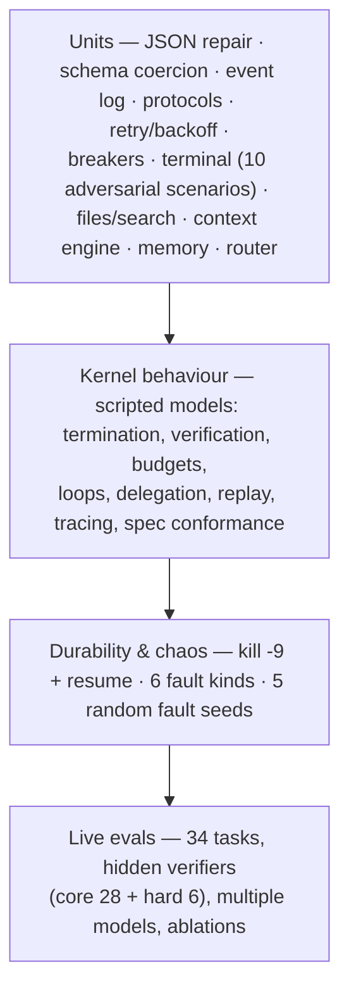

# 13 — Evaluation & Testing

> Status: **Implemented** · Code: `tests/`, `evals/` · Results: [evaluation/RESULTS.md](evaluation/RESULTS.md)

Two questions, two instruments:

1. **Is the harness correct?** → deterministic offline tests (no model, no network).
2. **Is the agent good?** → live evaluations against real models with hidden verifiers, ablations and repeats.

## 1. Test pyramid



| Suite | File | Tests | What it proves |
|---|---|---|---|
| Foundation | `test_foundation.py` | 28 | lenient JSON, schema coercion/errors, event log (torn tail, corruption, 8-thread appends), BM25 memory, router (incl. regression for the `merge_intervals`→git bug) |
| Gateway | `test_gateway.py` | 28 | protocol encode/decode edge cases, retry schedule & `Retry-After`, overflow detection, auth, protocol auto-downgrade, **SSE streaming** (split tool arguments, keep-alives, `stream_options` fallback, broken streams, error events), fail-over & breakers, record/replay divergence |
| Tools | `test_tools.py` | 24 | persistent shell semantics under abuse, file/search tools, registry fault isolation, parallel ordering |
| Context | `test_context.py` | 7 | projection, pairing invariant after clearing/compaction/interruption, fallback summaries, emergency truncation, calibration |
| Kernel | `test_kernel.py` | 26 | every stop condition, final-prose detection, nudges, verification loops, budgets, wrap-up hardening, overflow recovery, resume (crash, `model_error`, budget, downtime-excluded wall time), delegation, replay, span conventions |
| Workflow & chaos | `test_workflow_and_chaos.py` | 6 | workflow loops/journal skip, 9 injected faults of all 6 kinds, 5 random-fault seeds, real `kill -9` + resume |
| Spec conformance | `test_specs.py` | 3 | every emitted artifact validates against `spec/schemas/*.json`; event types in code = spec |

Run: `python3 -m unittest discover -s tests -t .` — 122 tests, ~12 s. The suite is run with `-W error::ResourceWarning` (leaked files/processes fail the build) and was run three consecutive times without flakes.

**Docs are tested too:** `python3 scripts/check_diagrams.py` parses all Mermaid diagrams with Mermaid's own parser (it caught 2 broken diagrams), and `docs/17` is regenerated from code by `scripts/gen_prompt_doc.py`.

**Bugs found by the suite before any live run:** a race between parallel sub-agents sharing shell script files; text protocol dropping tool instructions when a request has no system message; `notes` failing when the session directory did not exist yet; leaked pipes when replacing a dead shell.

## 2. Live evaluation design

### 2.1 Principles
- **Hidden, deterministic verifiers.** The agent never sees the checker. Checks are exact where the task is exact (numbers, orderings, file sets) and structural where it is not (headings, word counts, required facts).
- **Traps that punish shallow work.** Dirty rows and inconsistent casing; decoy numbers (5xx-looking sizes and paths in logs); superseded documents; planned-but-unreleased versions; tie-breaking rules; a performance threshold; an `eval`-ban for the parser; retry-vs-404 semantics against a live flaky server.
- **Verifiers are tested code.** Every verifier must (a) reject an untouched workspace and (b) accept an independent reference solution — `python -m evals.reference` checks both for all 34 tasks. This caught two verifier bugs (a wrong reference schedule; a regex that banned `re.compile`), which would otherwise have silently mis-scored agents.
- **Isolation.** Fresh workspace per task outside the repository; sessions and memory per run directory; model fail-over disabled in comparative runs so each result is attributable to one model.

### 2.2 Task inventory

| Tier | Category | Tasks |
|---|---|---|
| core | coding | code-lru-cache · code-intervals-tests · code-cli-todo · code-optimize · refactor-rename |
| core | debugging | debug-inventory (3 planted bugs incl. banker's rounding) · debug-crash-hardening |
| core | ops | ops-log-forensics · ops-organize-files · ops-archive-checksum · ops-config-audit |
| core | web / git | ops-http-service · web-local-docs · git-feature-flow |
| core | data | data-sales-report · data-sqlite-analytics · data-json-flatten · data-svg-chart |
| core | math / reasoning | math-digit-sum · math-grid-paths · reason-schedule (50 valid of 40,320) |
| core | writing / extraction | write-api-docs · write-exec-summary · extract-invoices (EU number formats, DD/MM dates, ¥) |
| core | research / general | research-multihop (superseded docs) · research-parallel · qa-knowledge · general-ambiguous |
| hard | coding | hard-expr-evaluator (Python semantics, no eval, 600 randomised differential cases) · hard-markdown (12 spec cases) |
| hard | data | hard-sessionize (mixed UTC offsets, unsorted) |
| hard | debugging | hard-bug-hunt (3 bugs across 4 modules; one integration test) |
| hard | web | hard-flaky-api (retry 503, never retry 404; counted server-side) |
| hard | research | hard-delegate-research (5 product lines, explicit parallel delegation, decoys) |

### 2.3 Metrics
Per task: pass/fail, state, stop reason, turns, tool calls, input/output tokens, requests, wall time, models used, whether it delegated, compactions. Aggregates: pass rate (overall, per category), median turns/tokens/wall, total tokens.

### 2.4 Experimental protocol
1. **Model comparison:** same suite, same harness, different models.
2. **Ablation:** same model, `--mode minimal` (bash/read/write/edit/finish; no skills, hints, memory, nudges, verification) vs full.
3. **Tiers:** core vs hard (discrimination at the top end).
4. **Context stress:** `--context-window N` far below the model's real window, to force clearing and compaction live.
5. **Repeats:** `--repeat k` for variance.
6. **Infra vs capability:** failures are classified from the event log (`model.error` with transport kinds ⇒ infra); both raw and infra-adjusted numbers are reported, and infra-failed sessions are resumed to show recovery.

## 3. Adding a task

```python
# evals/tasks/<module>.py
def my_setup(ws: Path) -> dict | None:        # create inputs; return hidden truth for the verifier
    write(ws, "input.csv", ...); return {"expected": 42}

def my_verify(ws: Path, res: RunResult, ctx: dict) -> tuple[bool, str]:
    c = Check(); c.eq(read_answer(ws), ctx["expected"], "answer"); return c.result()

TASKS.append(EvalTask("my-task", "data", "instruction…", my_setup, my_verify, max_turns=20))
```
Then add a reference solution in `evals/reference.py` and run `python -m evals.reference` — a task without a passing reference and a failing untouched-workspace check is not admitted.

## 4. Running

```bash
python -m evals.runner --model z-ai/glm-5.3 --tasks core --workers 4 --out /tmp/runs/glm   # core suite
python -m evals.runner --tasks hard --mode minimal --out /tmp/runs/glm-hard-min           # ablation on hard tier
python -m evals.runner --tasks data,research --context-window 24000 --out /tmp/runs/ctx   # context stress
```
Outputs: `results.json` (all records + summary) and `report.md` per run; published copies in `evals/results/`.
