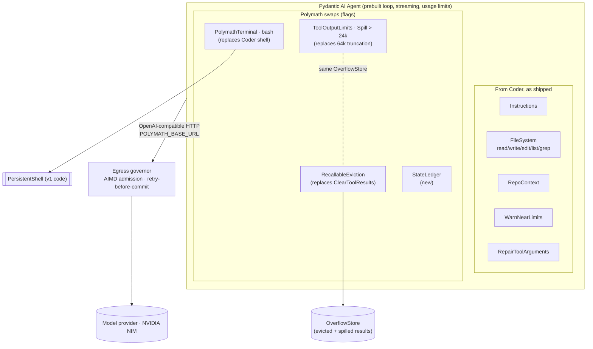
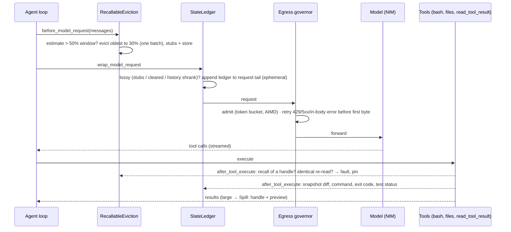
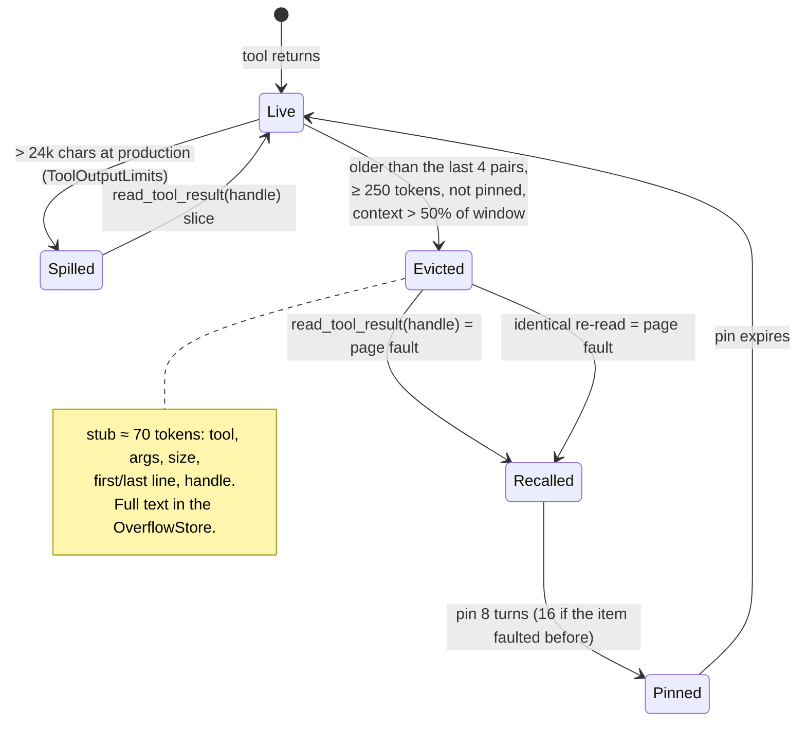

# 18 — Polymath v2: a prebuilt harness, enhanced where measurement says it falls short

> Status: **Implemented; experiments running** · Code: `polymath/v2/`, `polymath/egress/` · Decisions: [ADR-011](adr/ADR-011-v2-foundation.md) (foundation), [ADR-012](adr/ADR-012-egress-governor.md), [ADR-013](adr/ADR-013-keep-polymath-terminal.md), [ADR-014](adr/ADR-014-recallable-eviction-and-ledger.md) · Research: [docs/research](research/README.md) · Tests: `tests/test_v2.py`, `tests/test_egress.py`

## 1. The idea in one paragraph

v1 was a from-scratch, standard-library harness. v2 doesn't rebuild what the ecosystem already does well. It takes a **prebuilt agent harness as shipped**, the Pydantic AI harness's `Coder` composition, and **replaces exactly the parts that measurably fall short** with Polymath components, each switchable, so every difference in an experiment traces to one swap:

- the terminal (14/14 vs 10/14);
- irreversible context clearing (it can't recover what it dropped);
- the missing state ledger;
- the missing account-level rate control.

Everything not swapped (instructions, file tools, repository context, argument repair, limit warnings, the agent loop, model adapters) is Coder's own object, not a re-typed copy.

## 2. Layers



| Layer | Component | Origin | Why this one (evidence) |
|---|---|---|---|
| Loop | `pydantic_ai.Agent` | prebuilt | Typed capability hooks around every model request and tool call; streaming; usage limits (R1) |
| Instructions, files, repo context, arg repair, limit warnings | `Coder` parts | prebuilt, **unmodified** | Good as shipped; no measured shortfall |
| Shell | `PolymathTerminal` | Polymath | 14/14 vs best prebuilt 10/14; prebuilt shells lose tails, leak or orphan processes, run in `/` (R3, ADR-013) |
| Large outputs | `ToolOutputLimits(Spill)` | prebuilt, re-configured | Lossless handle + preview instead of Coder's lossy 64k truncation |
| Old results | `RecallableEviction` | Polymath | Prebuilt clearing is irreversible; addressable eviction + fault pinning + reacquisition metrics (R2 H1/H3/H5, ADR-014) |
| Verifiable state | `StateLedger` | Polymath | Selection can't hallucinate; derived from executions (R2 H2, ADR-014) |
| Egress | governor | Polymath | Account-wide AIMD; the in-200 overload retried before commit (R4, ADR-012) |

## 3. One model turn, end to end



## 4. The life of a tool result



## 5. Configuration

| Knob | Default | Where |
|---|---|---|
| `V2Options(terminal, recall, ledger)` | all `True` | `polymath/v2/agent.py` (each `False` restores Coder's part) |
| `V2Options(addressable)` | `True` | `False` = same eviction policy with the irreversible placeholder (the H1 control arm) |
| `V2Options(context_window)` / `POLYMATH_V2_CONTEXT_WINDOW` / `--context-window` | per-model table (`polymath/config.py`) | An explicit value also applies to Coder's clearing, so all arms work under equal pressure |
| Eviction trigger / target / keep / min size / pin | 0.5 / 0.3 / 4 pairs / 250 tokens / 8 turns | `RecallableEviction` fields |
| Spill threshold | 24,000 chars (preview 1,000) | `SPILL_OVER_CHARS` |
| Model endpoint | `POLYMATH_BASE_URL` → NIM | the egress governor for shared accounts |

## 6. Running it

```bash
pip install -e '.[v2,egress]'
export NVIDIA_NIM_API_KEY=nvapi-…
python -m polymath.egress --port 8787 &                    # optional but recommended on shared accounts
export POLYMATH_BASE_URL=http://127.0.0.1:8787/v1
python -m polymath.v2 "make the tests in tests/ pass" --workspace ./repo -v
```

Each run ends with a telemetry line: requests, tokens, evictions, **reacquisitions**, ledger injections. In the eval harness: `--stack polymath-v2` (or the ablations `polymath-v2-terminal`, `-context`, `-clear`, `-recall`).

## 7. What is proven and what is not

| Claim | Status |
|---|---|
| The terminal is more robust than every prebuilt shell | **Measured** (R3), deterministic: 14/14 vs best prebuilt 10/14 |
| The governor removes rate-limit losses across stacks | **Measured** live (R4): 0 give-ups under 8 agents in normal conditions. During a provider outage the loss-tolerant, per-model version turned failures into queueing; a few were still given up and are visible |
| Evicted results are recoverable exactly, pairing intact, ledger kept out of history | **Tested offline** against a real agent (`tests/test_v2.py`) |
| v2 ≥ the prebuilt `Coder` on the 28-task core suite | **Parity** (R5 §5.1): 50/56 each over two repeats, sign test p = 1.00. The one systematic difference (`git-feature-flow`, both repeats) favours v2 through terminal hygiene |
| Eviction policy under context pressure | **Measured** (R6): the prebuilt clearing failed `ret-token-audit` 0/2 by clearing an 11-token plan (the model hallucinated services); every v2 policy passed 4/4. The **size floor** is what matters |
| Addressable eviction (H1) reduces lost-fact failures | **Not supported on this model** (R6 F2): the model keeps noted facts in its reasoning, which is carried back. Recall rescued runs only where the model hadn't taken notes |
| Stub previews | **Measured** (R6 F5): 3-line tail previews cut recalls 7 → 1 and tokens −55 % with no loss; now the default |
| The ledger reduces state-reporting errors | **No pass-rate difference observed**; made the rename task the cheapest v2 run (R6 F4) |
| Which prebuilt stack is the best foundation | [ADR-011](adr/ADR-011-v2-foundation.md); five-stack table on one healthy model in R5 §5.2 |
