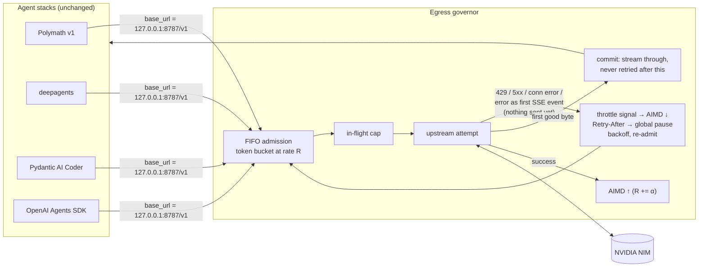

# R4 — Egress governor: account-wide adaptive rate control beneath every SDK

> Status: **Implemented and running in production-like load** · Code: [`polymath/egress/governor.py`](../../polymath/egress/governor.py) · Tests: [`tests/test_egress.py`](../../tests/test_egress.py) (16) · Run: `python -m polymath.egress --port 8787 --log-path governor.jsonl`, then point any OpenAI-compatible client at `http://127.0.0.1:8787/v1` (for Polymath and the eval backends: `POLYMATH_BASE_URL`).

## 1. The measured problem

| Run | Setup | Infra losses |
|---|---|---|
| v1.2 GLM-5.3 core, full mode | ~5 concurrent eval runs on one account, each client retrying on its own (7 attempts, exp. backoff) | **9 / 28 tasks** died of `HTTP 429` after exhausting retries |
| First 3-stack bake-off (Nemotron) | 3 stacks × 2 workers, each SDK with its own recommended retries | polymath lost tasks at `turns=0`; deepagents reported "completed" runs whose last message was an exhausted-retry error (D3); run aborted as uninformative |
| Pydantic AI smoke runs | 2 workers | runs killed by `APIError: Service temporarily overloaded`, an error sent **inside an HTTP 200 stream** (D5) |

Two structural causes, neither fixable inside a single client:

1. **The limit is per account; retries are per client.** N clients that each back off independently still re-collide, because none of them knows the others exist. Exponential backoff with jitter decorrelates *one* client's retries from itself, not from its neighbours'.
2. **Errors inside a 200.** NIM reports overload as the first SSE event, `data: {"error": "Service temporarily overloaded"}`, after a `200 OK` status line. Transport-level retry (openai `max_retries`, Pydantic AI's tenacity transports) has already accepted the response by then.

## 2. Design

An OpenAI-compatible **reverse proxy**. Clients change only `base_url`. Everything below the proxy (retry, pacing) is shared, so every SDK sees identical infrastructure behaviour. That also makes cross-stack comparisons fair.

**Admission: FIFO token bucket.** `reserve()` hands out slots `1/R` apart, in call order, so ordering is fair and no request starves.

**AIMD, made loss-tolerant (§4).** The control law TCP uses to share a bottleneck it can't observe directly, with one correction learned on NIM:
- success: `R ← min(R_max, R + α)`;
- throttle signal (429, 503, in-body overload text): `R ← max(R_min, R·β)`, **at most once per `cooldown_s`**, and only when recent throttling looks load-induced (§4).

The cooldown is essential. Eight in-flight requests that all hit the same congestion episode return eight 429s, and without it they would cut R by β⁸. With it they are counted as one signal. `Retry-After` pauses admission for **everyone**, because the limit it reports is account-wide.

**Retry before commit, never after.** A response is *committed* when its first byte is forwarded to the client. Before that, anything can be retried transparently:
- 429 / 408 / 409 / 5xx;
- connection errors;
- an idle timeout before the first event;
- an OpenAI-style error object as the **first SSE `data:` event** or as the body of a non-streamed 200.

After commit, errors pass through unchanged. The client has consumed data, and replaying would duplicate it. Tests pin both halves (`test_retries_overload_reported_inside_200_stream`, `test_error_after_first_chunk_is_committed_not_retried`).

**Fail visibly.** After `max_attempts` or `deadline_s`, the client receives the **last real error**, with its status. An in-body error it couldn't retry becomes an explicit `503` with the provider's message, so a hidden failure becomes a visible, retryable one.

**Observable.** `GET /__governor/stats` returns counters and the current rate. The optional JSONL log records, per request: model, the status of every attempt, queue wait, outcome and duration.

Defaults: `rate=0.5/s`, `α=0.02`, `β=0.6`, `cooldown_s=10`, `throttle_window=40`, `decrease_above=0.35`, `min_rate=0.1`, `max_inflight=8`, `max_attempts=10`, `deadline_s=900`, idle timeout 300 s. All are CLI flags.

## 3. Evidence (live, four-stack bake-off on one NIM account)

Snapshot about 45 minutes into the R5 bake-off: 4 stacks × 2 workers = 8 concurrent agents through one governor.

| Metric | Value |
|---|---|
| Requests | 306 |
| Completed | 296 (the rest in flight) |
| **Given up** | **0** |
| Throttle signals absorbed | 56 (of which in-body overloads: 23) |
| Rate decreases (after cooldown merging) | 22 |
| Discovered sustainable rate | ≈ 0.37–0.7 req/s (the rate oscillates in the AIMD sawtooth) |
| Max queue wait | 28.8 s |

Before the governor, the same load pattern lost whole tasks to 429s. Since it went in, no task in the bake-off has failed for infrastructure reasons (R5 reports the final numbers).

## 4. Correction: plain AIMD misread the provider, and the data showed it

The first version cut the rate on **every** throttle signal (once per cooldown), which is textbook AIMD. About three hours into the bake-off the data contradicted the assumption behind it:

- The rate had fallen to its floor, **0.05–0.09 req/s (about 4 requests/min)**, far below any plausible account limit, **and 429s kept coming**.
- The share of requests throttled did not respond to our rate: **18 %** at ~0.5 req/s early in the run, **22 %** at ~0.07 req/s later.
- Correlating 429s with our own concurrency (estimated from the request log, 752 first attempts) showed the **opposite** of what load-induced throttling predicts:

| Our requests in flight when an attempt started | 0 | 1 | 2 | 3 | 4 | 5 | 6–7 |
|---|---|---|---|---|---|---|---|
| Share of attempts answered 429 | **66 %** (n=29) | 12 % (190) | 8 % (195) | 5 % (191) | 5 % (84) | 5 % (43) | 0 % (20) |

Median upstream time was 2.1 s (p90 9.6 s). So the account was never close to a concurrency limit either. The in-flight estimate is approximate, and part of the 66 % is reverse causality: after throttles, fewer of our requests are in flight. Even so, the data rules out "our load causes the 429s". They are **provider-side capacity throttling** for this model, the same condition that produces NIM's in-body "Service temporarily overloaded". Cutting our rate in response did nothing except cut our throughput by about 8×.

This is a known pitfall in network congestion control: loss that isn't caused by congestion (e.g. wireless loss) must not trigger multiplicative decrease, which is why BBR-style controllers don't treat background loss as a congestion signal. The corrected rule (`AimdLimiter.on_throttle`):

- every attempt's outcome goes into a sliding window of the last `throttle_window` = 40 attempts;
- a throttle cuts the shared rate, and lets `Retry-After` pause everyone, **only if** the window's throttle fraction is ≥ `decrease_above` = 35 % (with at least 10 samples). Congestion we cause makes most requests beyond the limit fail, so the fraction jumps. Background throttling holds a steady lower fraction;
- below the threshold, a throttle only delays **its own** request (exponential backoff, honouring `Retry-After`) and is retried as before;
- the floor rose from 0.05 to 0.1 req/s.

Tests pin both regimes (`test_background_throttling_does_not_cut_the_rate`, `test_burst_of_throttles_is_one_congestion_signal`). The governor was swapped for the corrected version during the bake-off, at 02:16:18 container time; §3's numbers are from the first version. Trials that overlapped the swap are audited in R5.

## 5. Limits and honest caveats

- **It trades latency for completion.** Queueing replaces failing. Under a hard account limit that is the right trade for batch and agent work, but a latency-critical interactive product would want priority classes. They aren't implemented.
- **Throughput is capped by the account.** The governor finds the limit; it can't raise it. The R5 bake-off takes hours because about 0.4–0.7 req/s is what this account sustains.
- **Single process.** The state lives in one proxy. Several machines sharing one account would need the bucket in a shared store (e.g. Redis) or a single egress point.
- **Semantics of in-body errors.** Any OpenAI-style error object in a 200 before commit is treated as retryable. A deterministic in-body error would be retried `max_attempts` times before it surfaces. We have only observed transient ones (overload) on NIM.
